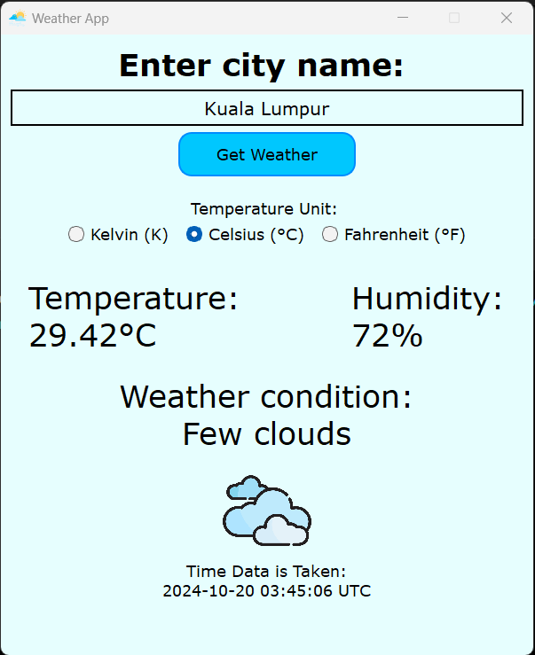

# About

A simple Python GUI application using PyQt5 to get some weather info in a specified city using [OpenWeather - Current Weather Data API](https://openweathermap.org/). 

Info Given:
- Temperature (Kelvin, Celsius or Fahrenheit)
- Relative Humidity (Percentage)
- Description of weather condition with associated icon
- Time data is taken (UTC time)

## How to Use

Ensure that you are connected to the Internet. After that, you only need to type in the name of the city (not case-sensitive) and click the "Get Weather" button. The weather info will then be displayed.

If you wish to get the temperature in a different unit, you can switch the temperature unit by using the given buttons and pressing "Get Weather" again.

If you typed the city name wrongly, an error will be shown. Don't use short forms (like KL for Kuala Lumpur, or LA for Los Angeles) and recheck your spelling. The API is not smart enough to figure that out for you. :(

  

## Upcoming Features

There are many more weather info about the city that can be added, such as wind speed, wind direction, precipitation, cloudiness, visibility, etc...

For now though, the 4 info given should be the most important. I will (probably) think of a way to fit all the extra info in the GUI in the future.
